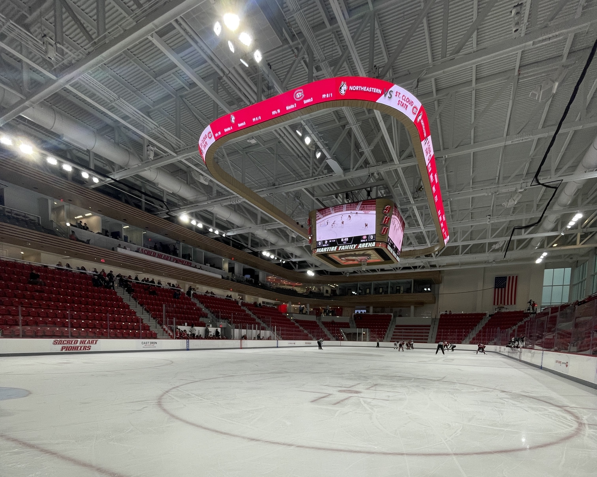
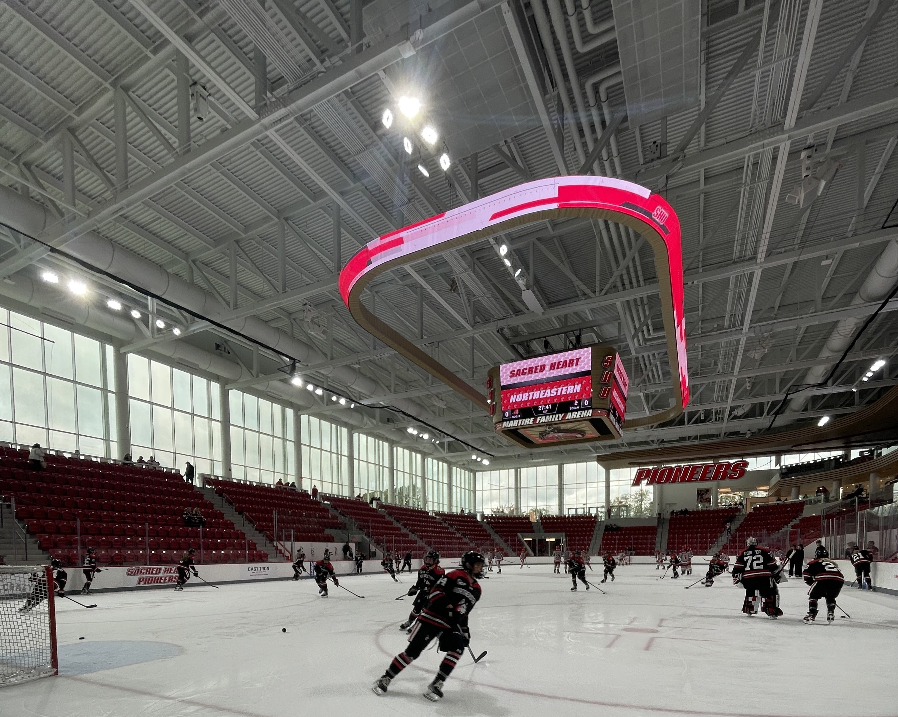

# Martire Family Arena 

Opened in January of 2023, the Martire Family Arena has some of the nicest facilities I have seen.

| |   |
|---|---|

The arena has one main bowl that goes up to the glass around the ice except for two ice level tunnels that allow for people to enter the ice. One of the tunnels is used for the Zambonis. In each of the tunnels has two photos holes leading to a total of four. On the Zamboni side there is often cold standing water, with improper shoes it can be difficult to keep feet warm. Ice level can be a tad bit difficult to reach. There is a balcony level which houses a club boxes, luxury seating, and media. Across from the media boxes are massive windows which let a large amount of natural light in. 

One of the highlights was the deep-fried max & cheese that you could get served in a novelty helmet! 

I also enjoyed seeing the ice dumped into a pool of water.  Very fun to watch 10/10.
