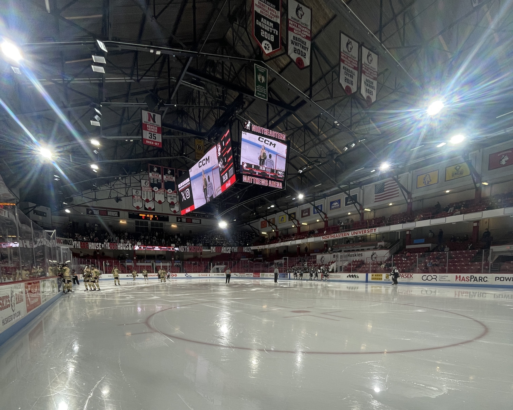

# Matthews Arena

The historic Matthews Area is home of both men's and women's hockey, but not for long. 

Matthews area has both an upper and lower bowl. The lighting was improved prior to the start of the 23-24 season. Around the edges of there is a trench separating the lower bowl from dasher boards and glass. This is very nice from a photography prospective as it allows photogs to get close to the glass without too much difficulty. The trenches are accessible via stairs at both ends of the ice or via the tunnels. The tunnels can are not too difficult to navigate but the stairs are the most direct. There are two photo holes located at opposing corners of the ice.

One amazing part of Matthews Arena is the *Jack Grinold Media Center*, located above the visitor's bench. It has great views of the ice for casting games. It can be a little cramped but the location is worth it.
