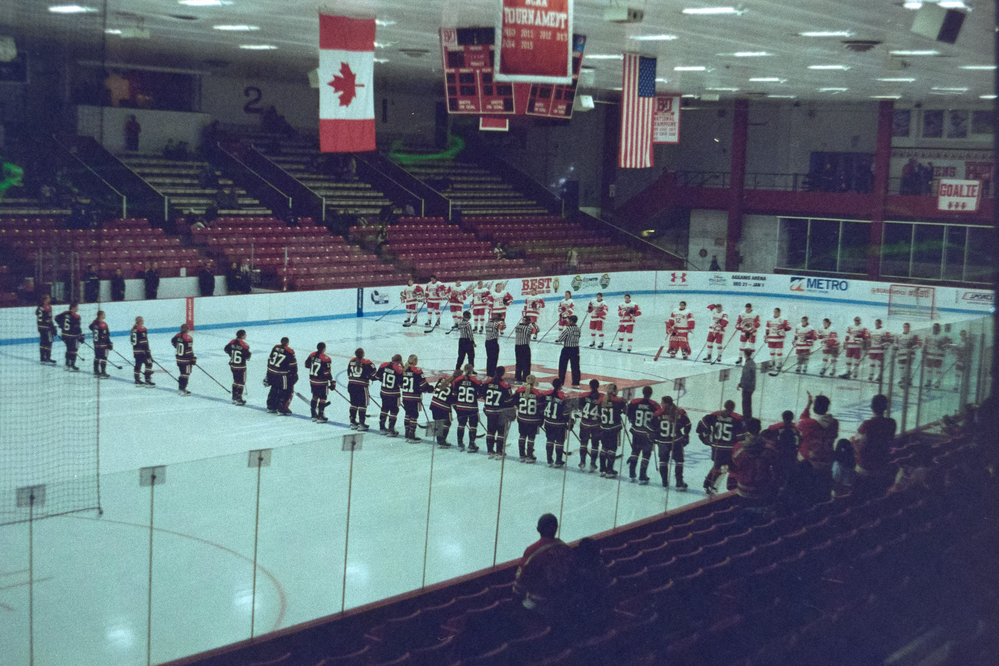

# Walter Brown Arena

Walter Brown Arena, often called Wally B, Boston University Terriers women's ice hockey team. 

Walter Brown Arena is comprised of two stands that run along the long edge of the rink. The stands are connected by elevated walkways near the entrance with the media section on the opposite. Behind each of the goals there is an open area where there are two photo holes on each side. It is a relatively small arena but it has an almost cozy feel. 

The location of the media booths over the goal is an interesting choice however they often provide pizza. 